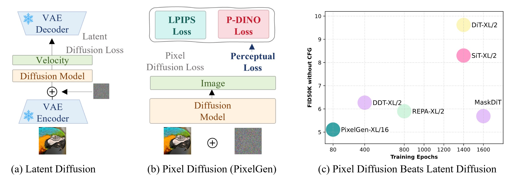
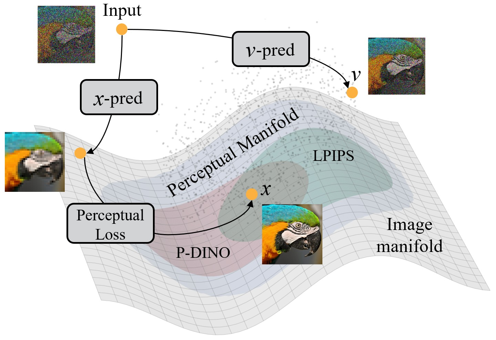
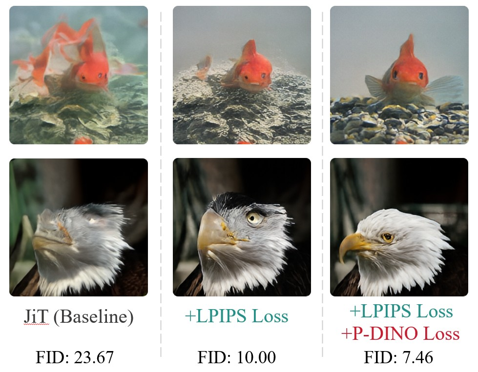
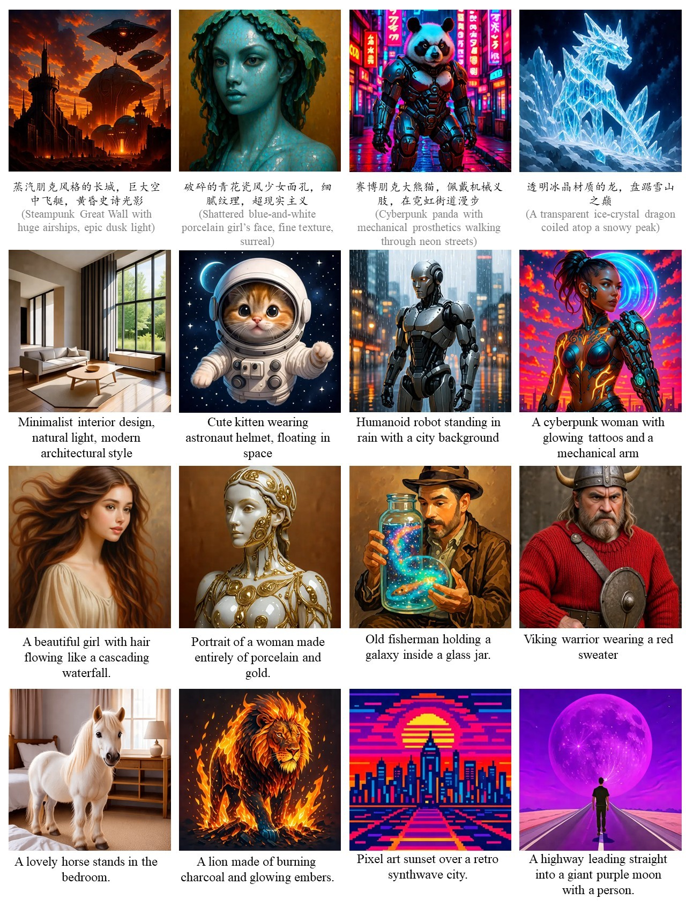
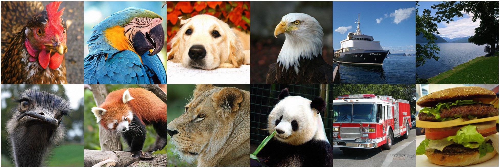
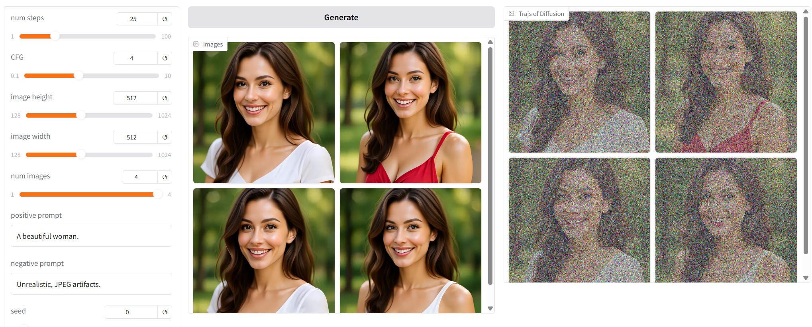

# PixelGen: Improving Pixel Diffusion with Perceptual Loss

<div class="is-size-5 publication-authors", align="center",>
  <span class="author-block">
    <a href="https://zehong-ma.github.io/" target="_blank">Zehong Ma</a><sup>1</sup>,&nbsp;
  </span>
  <span class="author-block">
    <a href="https://xuruihan.github.io/" target="_blank">Ruihan Xu</a><sup>1</sup>,&nbsp;
  </span>
  <span class="author-block">
    <a href="https://www.pkuvmc.com/" target="_blank">Shiliang Zhang</a><sup>1</sup><sup>*</sup>,&nbsp;
  </span>
</div>

<div class="is-size-5 publication-authors", align="center",>
  <span class="author-block"><sup>1</sup>State Key Laboratory of Multimedia Information Processing, <br>School of Computer Science, Peking University,&nbsp;</span>
</div>

<h5 align="center">

[](https://huggingface.co/papers/2602.02493)
[](https://arxiv.org/abs/2602.02493) 
[](https://zehong-ma.github.io/PixelGen/) 
[](https://dd0d187fc54e4b00ee.gradio.live/) 
[](https://github.com/Zehong-Ma/PixelGen/)
</h5>

<div class="content has-text-centered">
          <br>
          <span style="font-size: 0.8em; width: 100%; display: inline-block;">Figure 1: Visualization of 512x512 images generated by our PixelGen.</span>
</div>


## 🫖 Introduction 
We introduce PixelGen, a simple pixel diffusion framework with perceptual loss. Instead of modeling the full image manifold, PixelGen introduces two complementary perceptual losses to guide diffusion model towards learning a more meaningful **perceptual manifold**. An LPIPS loss facilitates learning better local patterns, while a DINO-based perceptual loss strengthens global semantics. With perceptual supervision, PixelGen surpasses strong latent diffusion baselines. It achieves an FID of 5.11 on ImageNet-256 without classifier-free guidance using only 80 training epochs, and demonstrates favorable scaling performance on large-scale text-to-image generation with a GenEval score of 0.79.

<div class="content">
            <br>
</div>

- We achieve **5.11 FID** on ImageNet256x256 without CFG at 80 epochs, surpassing REPA's 5.90 FID at 800 epochs.
- We achieve **1.83 FID** on ImageNet256x256 with CFG 160 epochs, competetive with latent diffusion models.
- We achieve **0.79 overall score** on GenEval Benchmark with PixelGen-XXL/16.
- **If you like our project, please kindly give us a star ⭐ on GitHub.** We hope to collaborate with you on building better pixel diffusion models, specifically looking at better samplers, CFG strategies, architectures, and refined loss design. Please feel free to reach out if you'd like to discuss ideas.

##  Illustration of Perceptual Manifold 


<div class="content">
            <br>
            <span style="font-size: 0.8em; width: 85%; display: inline-block;">Illustration of different manifolds within the pixel space. The image manifold is a large manifold containing both perceptually significant information and imperceptible signals. The perceptual manifold contains perceptually important signals, providing a better target for pixel space diffusion. P-DINO and LPIPS are the two complementary perceptual supervision utilized in PixelGen.
            </span>
          </div>

## 🧩 Visualizations
+ Effectiveness of the perceptual losses in PixelGen.
<div class="content">
            <br>
</div>

+ Visualization of more images generated by our text-to-image PixelGen.
<div class="content">
            <br>
</div>

+ Visualization of 256*256 images generated by our class-to-image PixelGen.
<div class="content">
            <br>
</div>

## 🎉 Checkpoints

| Dataset       | Epoch | Model         | Params | FID   | HuggingFace                           |
|---------------|-------|---------------|--------|-------|---------------------------------------|
| ImageNet256   | 80   |   PixelGen-XL/16 | 676M   | 5.11 (w/o CFG)  | [🤗](https://huggingface.co/zehongma/PixelGen/blob/main/PixelGen_XL_80ep.ckpt) |
| ImageNet256    | 160   |   PixelGen-XL/16 | 676M   | 1.83 (w/ CFG) | [🤗](https://huggingface.co/zehongma/PixelGen/blob/main/PixelGen_XL_160ep.ckpt) |

| Dataset       | Model         | Params | GenEval | HuggingFace                                              |
|---------------|---------------|--------|------|----------------------------------------------------------|
| Text-to-Image | PixelGen-XXL/16| 1.1B | 0.79 | [🤗](https://huggingface.co/zehongma/PixelGen/blob/main/PixelGen_XXL_T2I.ckpt) |
## 🔥 Online Demos

We provide online demos for PixelGen-XXL/16(text-to-image) on HuggingFace Spaces.

HF spaces: [https://dd0d187fc54e4b00ee.gradio.live](https://dd0d187fc54e4b00ee.gradio.live)

To host the local gradio demo, run the following command:
```bash
# for text-to-image applications
python app.py --config ./configs_t2i/sft_res512.yaml --ckpt_path=./ckpts/PixelGen_XXL_T2I.ckpt
```

## 🤖 Usages
In class-to-image(ImageNet) experiments, We use [ADM evaluation suite](https://github.com/openai/guided-diffusion/tree/main/evaluations) to report FID. 
In text-to-image experiments, we use BLIP3o dataset as training set and utilize GenEval to collect metrics.

+ Environments
```bash
# for installation (recommend python 3.10)
pip install -r requirements.txt
```

+ Inference
```bash
# for inference without CFG using 80-epoch checkpoint
python main.py predict -c ./configs_c2i/PixelGen_XL_without_CFG.yaml --ckpt_path=./ckpts/PixelGen_XL_80ep.ckpt
# for inference with CFG using 160-epoch checkpoint
python main.py predict -c ./configs_c2i/PixelGen_XL.yaml --ckpt_path=./ckpts/PixelGen_XL_160ep.ckpt
```

+ Train
```bash
# for c2i training
# Please modify the ImageNet1k path in the config file before training.
python main.py fit -c ./configs_c2i/PixelGen_XL.yaml
```

```bash
# multi-node training in lightning style, e.g., 4 nodes
export MASTER_ADDR={Your Config}
export MASTER_PORT={Your Config}
export NODE_RANK={Your Config}
export NNODES={Your Config}
export NGPUS_PER_NODE={Your Config}
python main.py fit -c ./configs_c2i/PixelGen_XL.yaml --trainer.num_nodes=4
```

```bash
# for t2i training
python main.py fit -c ./configs_t2i/pretraining_res256.yaml
python main.py fit -c ./configs_t2i/pretraining_res512.yaml --ckpt_path=./ckpts/pretrain256.ckpt
python main.py fit -c ./configs_t2i/sft_res512.yaml  --ckpt_path=./ckpts/pretrain512.ckpt
```

## 💐 Acknowledgement 

This repository is built based on [DeCo](https://github.com/Zehong-Ma/DeCo). Thanks for their contributions and [Shuai Wang](https://github.com/WANGSSSSSSS)'s support!

## 📖 Citation 
If you find PixelGen is useful in your research or applications, please consider giving us a star ⭐ and citing it by the following BibTeX entry.

```
@article{ma2026pixelgen,
      title={PixelGen: Improving Pixel Diffusion with Perceptual Loss}, 
      author={Zehong Ma and Ruihan Xu and Shiliang Zhang},
      year={2026},
      eprint={2602.02493},
      archivePrefix={arXiv},
      primaryClass={cs.CV},
      url={https://arxiv.org/abs/2602.02493}, 
}
```
